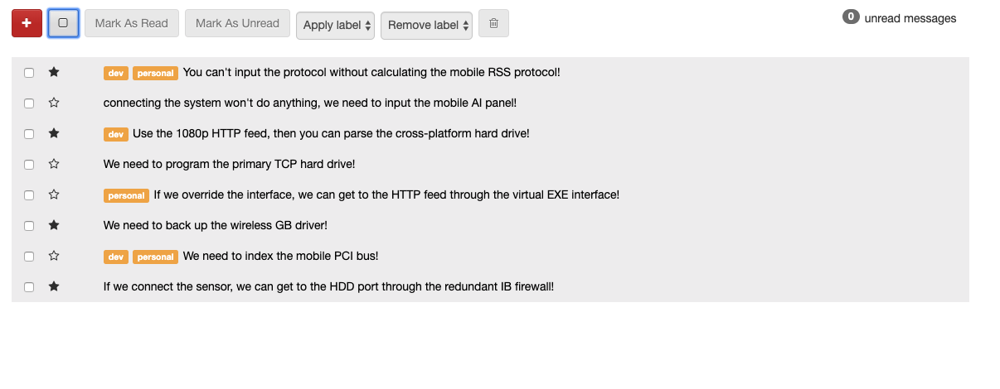

# Message Display build with React using React Context and React Hooks.

STORY:

Users should see a list of messages with the correct styles

When a user views the app
Then they should see a list of messages with their subjects
If the message is read, it should have the read style
If the message is unread, it should have the unread
If the message is selected, it should have the selected style and the box should be checked
If there are labels on a message, they should appear
If the message is starred, then the star should be filled in, otherwise it should be empty
Starring
Users should be able to star and unstar a message.

When a user clicks the star next to a message
Then it should toggle whether the message is starred or not
For example if it was starred, and you clicked on it, it should be unstarred
Selecting Individual Messages
Users should be able to select and deselect individual messages.

When a user checks the checkbox on a message
Then the message should be highlighted

When a user unchecks the checkbox on a message
Then the message should _not_ be highlighted
Bulk Select / Deselect
Users should be able to select and deselect messages.

Given that no messages are selected
When a user checks the "Select All" checkbox
Then it should check all messages (and highlight them)

Given that some messages are selected
When a user checks the "Select All" checkbox
Then it should check all messages (and highlight them)

Given that all messages are selected
When a user unchecks the "Select All" checkbox
Then it should uncheck all messages (and unhighlight them)
Marking Messages as Read
Users should be able to mark messages as read.

When a user selects messages
And presses "Mark As Read"
Then each selected message should be marked as read
And should no longer be bold
Marking Messages as Unread
Users should be able to mark messages as unread.

When a user selects messages
And presses "Mark As Unread"
Then each selected message should be marked as unread
And should should appear bold
Deleting Messages
Users should be able to delete selected messages

When a user selects messages
And presses "Delete" (the Trash icon)
Then each selected message should be removed from the list
And the unread count should update
And "Select All" button should update
Adding Labels
When a user selects messages from the sidebar
And chooses a label from the "Add Label" dropdown
Then that label should be added to all selected messages
But if the message already contains the label then it should not be added twice
NOTE: It's OK to hard-code the list of labels

Removing Labels
When a user selects messages from the sidebar
And chooses a label from the "Remove Label" dropdown
Then that label should be removed from all of the selected messages that contain the label
NOTE: It's OK to hard-code the list of labels

NOTE: If you try to remove a label from a message that doesn't have that label, there should be no errors

Unread Message Count
Users should always see the number of unread messages

When a user changes which messages are read / unread
Then the unread count in the upper right-hand corner should update
And when there are 0 unread messages it should display "0 unread messages"
And when there is 1 unread message it should display "1 unread message"
And when there's more than 1 unread message it should display "_n_ unread messages"
Select All Button State
Users should see the state of the select all button change as messages are selected

When no messages are checked
Then the "Select All" button should be in the "unchecked" state

When some messages are checked
Then the "Select All" button should be in the "half-checked" state

When all messages are checked
Then the "Select All" button should be in the "checked" state
NOTE: the "Select All" button must stay in sync at all times.

Select All Button State
Users should not be able to click on toolbar items when no messages are selected

Load the messages from the server
When a user goes to your inbox app
The messages they see should be the ones loaded from the server
Actions should update the server-side
When a user stars or unstars a message
And then reloads the page
They should see that the data has been persisted

When a user marks messages read or unread
Or deletes messages
Or adds or removes labels
And then refreshes the page
Then they should see that the data has been persisted
NOTE: the server-side API you are running locally runs in memory, so if you restart it, the data will reset.

Add the ability to compose messages
When a user goes to the app
They should see a red plus button
And when they click that button
Then a compose form should appear
And when they fill out the subject and body and press Send
Then the compose form should go away
And the message should appear on the page
And when they refresh, the message should still appear (it's persisted on the server)

When a user opens the compose form
And then presses the red compose button
Then the compose form should close

